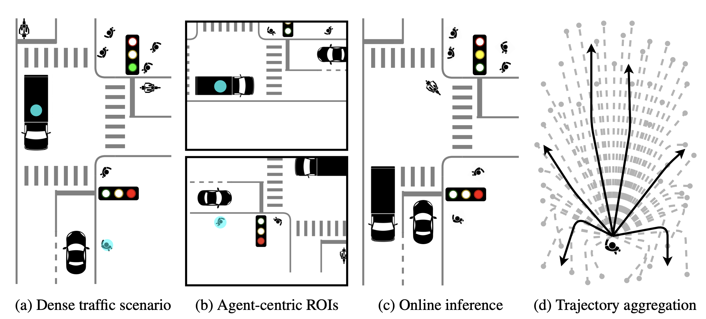
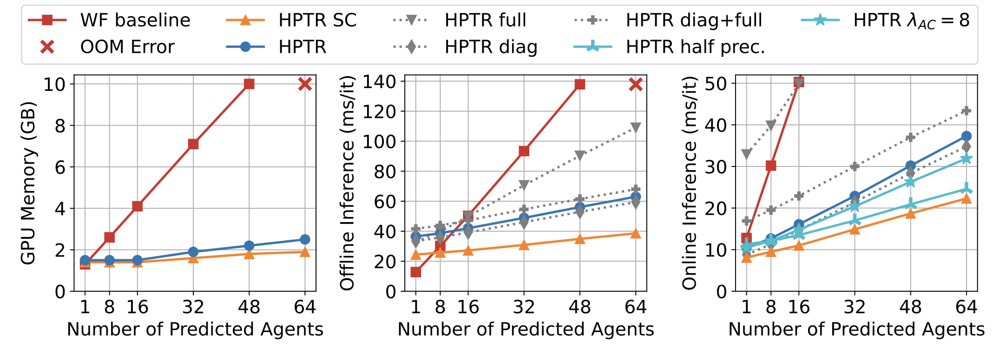

# HPTR

> **Real-Time Motion Prediction via Heterogeneous Polyline Transformer with Relative Pose Encoding**            
> [Zhejun Zhang](https://zhejz.github.io/), [Alexander Liniger](https://alexliniger.github.io/), [Christos Sakaridis](http://people.ee.ethz.ch/~csakarid/), Fisher Yu, and [Luc Van Gool](https://insait.ai/prof-luc-van-gool/). 
> 
> To appear in NeurIPS 2023. 
> We are preparing the camera-ready paper and the code release. Please check back later!

## Abstract

The real-world deployment of an autonomous driving system requires its components to run on-board and in real-time, including the motion prediction module that predicts the future trajectories of surrounding traffic participants. Existing agent-centric methods have demonstrated outstanding performance on public benchmarks. However, they suffer from high computational overhead and poor scalability as the number of agents to be predicted increases. To address this problem, we introduce the K-nearest neighbor attention with relative pose encoding (*KNARPE*), a novel attention mechanism allowing the pairwise-relative representation to be used by Transformers. Then, based on *KNARPE* we present the heterogeneous polyline Transformer with relative pose encoding (*HPTR*), a hierarchical framework enabling asynchronous token update during the online inference. By sharing contexts among agents and reusing the unchanged contexts, our approach is as efficient as scene-centric methods, while performing on par with state-of-the-art agent-centric methods. Experiments on Waymo and Argoverse-2 datasets show that *HPTR* achieves superior performance among end-to-end methods that do not apply expensive post-processing or ensembling. Our code will be publicly available.

     
      To efficiently predict the multi-modal future of numerous agents (1a), HPTR minimizes the computational overhead by: (1b) Sharing contexts among target agents. (1c) Reusing static contexts during online inference. (1d) Avoiding expensive post-processing and ensembling.

     
       HPTR is as efficient as scene-centric (SC) methods in terms of GPU memory consumption and inference latency, while being as accurate as agent-centric methods. We use standard Ubuntu, Python and Pytorch without optimizing for real-time deployment. We predict one scenario at each inference time on one 2080Ti. We repeat the inference of the same scenario for 100 times to simulate online inference, where the static map features are computed at the first step and reused for the next 99 steps. Compared to SOTA agent-centric method Wayformer (WF baseline), we achieve similar performance while reducing the offline inference latency by 60%, and the GPU memory consumption as well as the inference latency by 80%. By caching the static map features during online inference, HPTR can generate predictions for 64 agents in real time at 40 frames per second.

## License

This software is made available for non-commercial use under a creative commons [license](LICENSE). You can find a summary of the license [here](https://creativecommons.org/licenses/by-nc/4.0/).

## Acknowledgement

This work is funded by Toyota Motor Europe via the research project [TRACE-Zurich](https://trace.ethz.ch) (Toyota Research on Automated Cars Europe).