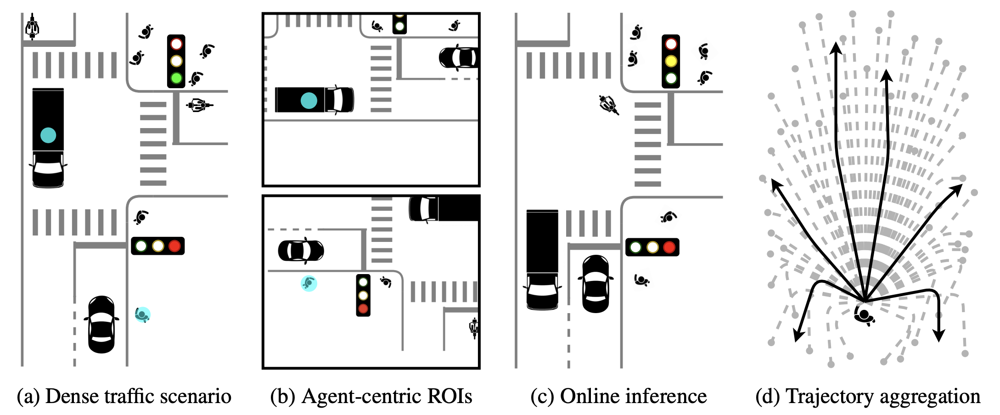

# HPTR

<p align="center">
     
     <br/>HPTR realizes real-time and on-board motion prediction without sacrificing the performance. <br/>To efficiently predict the multi-modal future of numerous agents (a), HPTR minimizes the computational overhead by: (b) Sharing contexts among target agents. (c) Reusing static contexts during online inference. (d) Avoiding expensive post-processing and ensembling.
</p>

> **Real-Time Motion Prediction via Heterogeneous Polyline Transformer with Relative Pose Encoding**            
> [Zhejun Zhang](https://zhejz.github.io/), [Alexander Liniger](https://alexliniger.github.io/), [Christos Sakaridis](https://people.ee.ethz.ch/~csakarid/), Fisher Yu and [Luc Van Gool](https://vision.ee.ethz.ch/people-details.OTAyMzM=.TGlzdC8zMjcxLC0xOTcxNDY1MTc4.html).<br/>
> 
> [NeurIPS 2023](https://neurips.cc/virtual/2023/poster/71285)<br/>
> [Project Website](https://zhejz.github.io/hptr)<br/>
> [arXiv Paper](https://arxiv.org/abs/2310.12970)

```bibtex
@inproceedings{zhang2023hptr,
  title = {Real-Time Motion Prediction via Heterogeneous Polyline Transformer with Relative Pose Encoding},
  booktitle = {Advances in Neural Information Processing Systems (NeurIPS)},
  author = {Zhang, Zhejun and Liniger, Alexander and Sakaridis, Christos and Yu, Fisher and Van Gool, Luc},
  year = {2023},
}
```

## Updates
- The model checkpoint for Argoverse 2 is available at this wandb artifact `zhejun/hptr_av2_ckpt/av2_ckpt:v0` ([wandb project](https://wandb.ai/zhejun/hptr_av2_ckpt)).
- HPTR ranks 1st in minADE and 2nd in minFDE on the [WOMD Motion Prediction Leaderboard 2023](https://waymo.com/open/challenges/2023/motion-prediction/).


## Setup Environment
- Create the main [conda](https://docs.conda.io/en/latest/miniconda.html) environment by running `conda env create -f environment.yml`.
- Install [Waymo Open Dataset](https://github.com/waymo-research/waymo-open-dataset) API manually because the pip installation of version 1.5.2 is not supported on some linux, e.g. CentOS. Run 
  ```
  conda activate hptr
  wget https://files.pythonhosted.org/packages/85/1d/4cdd31fc8e88c3d689a67978c41b28b6e242bd4fe6b080cf8c99663b77e4/waymo_open_dataset_tf_2_11_0-1.5.2-py3-none-manylinux_2_24_x86_64.manylinux_2_28_x86_64.whl
  mv waymo_open_dataset_tf_2_11_0-1.5.2-py3-none-manylinux_2_24_x86_64.manylinux_2_28_x86_64.whl waymo_open_dataset_tf_2_11_0-1.5.2-py3-none-any.whl
  pip install --no-deps waymo_open_dataset_tf_2_11_0-1.5.2-py3-none-any.whl
  rm waymo_open_dataset_tf_2_11_0-1.5.2-py3-none-any.whl
  ```
- Create the conda environment for packing [Argoverse 2 Motion Forecasting Dataset](https://www.argoverse.org/av2.html#forecasting-link) by running `conda env create -f env_av2.yml`.
- We use [WandB](https://wandb.ai/) for logging. You can register an account for free.
- Be aware
  - We use 4 *NVIDIA RTX 2080Ti* for training and a single 2080Ti for evaluation. The training takes at least 5 days to converge.
  - This repo contains the experiments for the [Waymo Motion Prediction Challenge](https://waymo.com/open/challenges/2023/motion-prediction/) and the [Argoverse 2: Motion Forecasting Competition](https://eval.ai/web/challenges/challenge-page/1719/submission)
  - We cannot share pre-trained models according to the [terms](https://waymo.com/open/terms) of the Waymo Open Motion Dataset.

## Prepare Datasets
- Waymo Open Motion Dataset (WOMD):
  - Download the [Waymo Open Motion Dataset](https://waymo.com/open/data/motion/). We use v1.2.
  - Run `python src/pack_h5_womd.py` or use [bash/pack_h5.sh](bash/pack_h5.sh) to pack the dataset into h5 files to accelerate data loading during the training and evaluation.
  - You should pack three datasets: `training`, `validation` and `testing`. Packing the `training` dataset takes around 2 days. For `validation` and `testing` it should take a few hours.
- Argoverse 2 Motion Forecasting Dataset (AV2):
  - Download the [Argoverse 2 Motion Forecasting Dataset](https://www.argoverse.org/av2.html#download-link).
  - Run `python src/pack_h5_av2.py` or use [bash/pack_h5.sh](bash/pack_h5.sh) to pack the dataset into h5 files to accelerate data loading during the training and evaluation.
  - You should pack three datasets: `training`, `validation` and `testing`. Each dataset should take a few hours.


## Training, Validation, Testing and Submission
Please refer to [bash/train.sh](bash/train.sh) for the training.

Once the training converges, you can use the saved checkpoints (WandB artifacts) to do validation and testing, please refer to [bash/submission.sh](bash/submission.sh) for more details.

Once the validation/testing is finished, download the file `womd_K6.tar.gz` from WandB and submit to the [Waymo Motion Prediction Leaderboard](https://waymo.com/open/challenges/2023/motion-prediction/). For AV2, download the file `av2_K6.parquet` from WandB and submit to the [Argoverse 2 Motion Forecasting Competition](https://eval.ai/web/challenges/challenge-page/1719/submission).


## Performance

Our submission to the [WOMD leaderboard](https://waymo.com/open/challenges/2023/motion-prediction/) is found here [here](https://waymo.com/open/challenges/entry/?challenge=MOTION_PREDICTION&challengeId=MOTION_PREDICTION_2023&emailId=5ea7a3eb-7337&timestamp=1684068775971677).

Our submission to the [AV2 leaderboard](https://eval.ai/web/challenges/challenge-page/1719/overview) is found here [here](https://eval.ai/web/challenges/challenge-page/1719/leaderboard/4098).

## Ablation Models

Please refer to [docs/ablation_models.md](docs/ablation_models.md) for the configurations of ablation models.

Specifically you can find the [Wayformer](https://arxiv.org/abs/2207.05844) and [SceneTransformer](https://arxiv.org/abs/2106.08417) based on our backbone. You can also try out different hierarchical architectures.

## License

This software is made available for non-commercial use under a creative commons [license](LICENSE). You can find a summary of the license [here](https://creativecommons.org/licenses/by-nc/4.0/).

## Acknowledgement

This work is funded by Toyota Motor Europe via the research project [TRACE-Zurich](https://trace.ethz.ch) (Toyota Research on Automated Cars Europe).